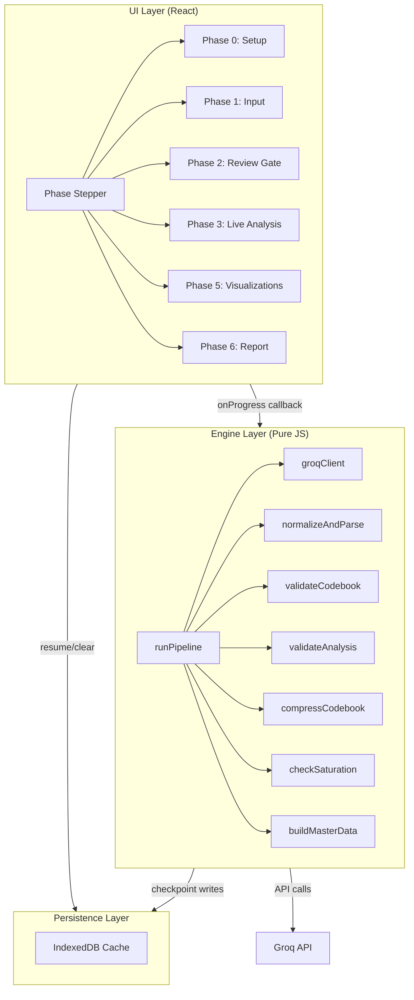

# Thematicus — Implementation Plan

**Source spec:** [specs_thematicus.md](file:///home/zenoguy/Desktop/Thematicus/specs_thematicus.md)  
**Target:** Single-page React app (Vite scaffold) + Groq API  
**Estimated scope:** ~8 milestones, single developer

---

## Architecture Overview



---

## Project Structure

```
Thematicus/
├── index.html                  # Entry point, CDN links for PDF.js & D3
├── vite.config.js              # Vite config
├── package.json
├── public/
│   └── favicon.svg
└── src/
    ├── main.jsx                # React root mount
    ├── App.jsx                 # Top-level: phase stepper + state orchestrator
    ├── App.css                 # Global design system + all component styles
    │
    ├── engine/
    │   ├── pipeline.js         # runPipeline() — core orchestrator
    │   ├── groqClient.js       # Groq API wrapper (rate limiting, backoff)
    │   ├── normalize.js        # normalizeAndParse() — JSON repair + schema validation
    │   ├── validators.js       # validateCodebook(), validateAnalysis()
    │   ├── codebookUtils.js    # compressCodebook(), mergeNewCodes()
    │   ├── saturation.js       # checkSaturation()
    │   ├── aggregator.js       # buildMasterData() — Phase 4 logic
    │   ├── prompts.js          # PHASE2_PROMPT, PHASE3_PROMPT, PHASE6_PROMPT constants
    │   └── cache.js            # IndexedDB read/write/clear wrapper
    │
    ├── components/
    │   ├── PhaseStepper.jsx     # Top progress bar (Phase 0–6)
    │   ├── SetupPanel.jsx       # Phase 0: API key + model selector
    │   ├── InputPanel.jsx       # Phase 1: PDF upload + theme upload
    │   ├── ReviewGate.jsx       # Phase 2: Codebook review/edit/merge UI
    │   ├── AnalysisPanel.jsx    # Phase 3: Live progress + evolution log
    │   ├── VisualizationPanel.jsx # Phase 5: Tabbed D3 charts
    │   ├── ReportPanel.jsx      # Phase 6: Generated report + export
    │   ├── ResumePrompt.jsx     # Cache detected → resume or clear
    │   └── ErrorBoundary.jsx    # Global error boundary
    │
    └── visualizations/
        ├── KnowledgeGraph.jsx   # D3 force-directed graph
        ├── Sunburst.jsx         # D3 partition sunburst
        ├── RadarChart.jsx       # D3 radial-line spider chart
        └── Heatmap.jsx          # D3 / CSS grid heatmap
```

> [!NOTE]
> The spec says "single .jsx artifact" but that is unrealistic for maintainability at this scale. The structure above uses a standard Vite + React project with clean separation. All D3 charts, the engine, and the UI are modular but ship as a single bundle via Vite.

---

## Milestone 1 — Project Scaffold & Design System

> Foundation: Vite project, global styles, phase stepper shell, error boundary.

### [NEW] `package.json` / Vite project

- `npx -y create-vite@latest ./ --template react`
- Dependencies: `idb` (IndexedDB wrapper)
- CDN links in `index.html`: PDF.js (`cdnjs`), D3.js v7

### [NEW] [App.css](file:///home/zenoguy/Desktop/Thematicus/src/App.css)

- CSS custom properties design system (color ramps, spacing, typography, shadows)
- Dark mode base with glassmorphism panels
- Google Font: Inter or Outfit
- Phase stepper styles (completed / active / pending)
- Responsive breakpoints
- Micro-animation keyframes (fade-in, slide-up, pulse)

### [NEW] [App.jsx](file:///home/zenoguy/Desktop/Thematicus/src/App.jsx)

- Top-level state via `useReducer`: `{ phase, apiKey, model, documents, themes, codebook, analyses, masterData, logs, cache }`
- Phase routing: render the correct panel based on `state.phase`
- `onProgress` callback wired from engine → UI state updates
- Error boundary wrapper

### [NEW] [PhaseStepper.jsx](file:///home/zenoguy/Desktop/Thematicus/src/components/PhaseStepper.jsx)

- Horizontal stepper: Phase 0 → Phase 6
- States: completed (checkmark), active (pulsing dot), pending (gray)
- Phase labels: Setup → Input → Codebook → Analysis → Aggregate → Visualize → Report

### [NEW] [ErrorBoundary.jsx](file:///home/zenoguy/Desktop/Thematicus/src/components/ErrorBoundary.jsx)

- React error boundary class component
- Friendly fallback UI with "Try again" button
- Logs error details to console

---

## Milestone 2 — Engine Utilities (No UI dependency)

> Pure JS functions — independently testable, no React imports.

### [NEW] [groqClient.js](file:///home/zenoguy/Desktop/Thematicus/src/engine/groqClient.js)

- `callGroq({ apiKey, model, systemPrompt, userPrompt })` → raw string response
- Rate limiting: 2s minimum delay between calls
- 429 handler: exponential backoff (5s → 10s → 20s → 40s), max 4 retries
- 500 handler: retry once after 3s, then throw
- Context length guard: truncate input to ~100k tokens with warning

### [NEW] [normalize.js](file:///home/zenoguy/Desktop/Thematicus/src/engine/normalize.js)

- `normalizeAndParse(rawString)` → parsed JSON or throws
- Pipeline: strip markdown fences → trim → remove comments → fix trailing commas → `JSON.parse()`
- Light structural repair on parse failure (unclosed brackets, etc.)
- Returns `{ success: boolean, data: object, repaired: boolean }`

### [NEW] [validators.js](file:///home/zenoguy/Desktop/Thematicus/src/engine/validators.js)

- `validateCodebook(codebook)` → `{ valid, errors[], cleaned }`
  - Every theme has: `id`, `label`, `definition`, `keywords[]`
  - Deduplicate against Gen 1 ids
  - Cap emergent themes at 3
- `validateAnalysis(analysis, codebook)` → `{ valid, errors[], cleaned }`
  - Intensity values clamped to [1, 5]
  - Quotes non-empty for intensity ≥ 3
  - Orphan `theme_id` tags discarded
  - `new_sub_codes`: required fields check
  - Cap: max 2 new sub-codes per document per theme
  - Cap: max 1 emergent theme per document
  - Confidence values clamped to [0.0, 1.0] (optional field — default to null if missing)

### [NEW] [codebookUtils.js](file:///home/zenoguy/Desktop/Thematicus/src/engine/codebookUtils.js)

- `compressCodebook(codebook)` → lightweight codebook for prompt injection
  - Strips `definition` (long text)
  - Limits `keywords` to top 5
  - Keeps only: `theme_id`, `label`, `sub_codes[].id`, `sub_codes[].label`
- `mergeNewCodes(codebook, newSubCodes, emergentThemes, docName)` → updated codebook
  - Appends new sub-codes under correct parent
  - Appends emergent themes with `generation: 3`, `emergent: true`, `triggered_by`
- `mergeSubCodes(codebook, idA, idB, mergedLabel)` → updated codebook (for review gate)

### [NEW] [saturation.js](file:///home/zenoguy/Desktop/Thematicus/src/engine/saturation.js)

- `checkSaturation(logs, threshold = 3)` → `{ detected: boolean, atDoc: string, consecutiveEmpty: number }`
- Counts consecutive log entries with zero `added_sub_codes` + zero `added_themes`

### [NEW] [aggregator.js](file:///home/zenoguy/Desktop/Thematicus/src/engine/aggregator.js)

- `buildMasterData(analyses, codebook, logs)` → `master_data` object
- Builds: intensity matrix, co-occurrence pairs, quote bank (sorted by intensity desc → doc), theme frequency stats, codebook evolution stats, saturation summary

### [NEW] [prompts.js](file:///home/zenoguy/Desktop/Thematicus/src/engine/prompts.js)

- `PHASE2_PROMPT_V1` — system + user template with `{{themes}}` and `{{samples}}` slots
- `PHASE3_PROMPT_V1` — system + user template with `{{codebook}}` and `{{docText}}` slots
  - Includes anchored intensity scale (1 = weak, 3 = moderate, 5 = dominant)
  - Includes `confidence: 0.0-1.0` field in output schema
- `PHASE6_PROMPT_V1` — system + user template with `{{masterData}}` slot
- Helper: `buildPrompt(template, variables)` → interpolated string

### [NEW] [cache.js](file:///home/zenoguy/Desktop/Thematicus/src/engine/cache.js)

- Uses `idb` library for IndexedDB wrapper
- `saveCheckpoint(data)` — write full checkpoint object
- `loadCheckpoint()` → checkpoint or null
- `clearCheckpoint()` — delete all cached data
- `hasCheckpoint()` → boolean
- Schema: matches §5.5 of spec (version, phase, last_completed_doc, codebook, analyses, completed_docs, logs, master_data)

---

## Milestone 3 — Pipeline Orchestrator

> Connects all engine utilities into the sequential pipeline.

### [NEW] [pipeline.js](file:///home/zenoguy/Desktop/Thematicus/src/engine/pipeline.js)

- `runPipeline({ apiKey, model, themes, documents, onProgress, existingCheckpoint })` → `Promise<master_data>`
- Orchestration:
  1. **Phase 2**: Build corpus preview (first ~300 words per doc) → call Groq → normalize → validate → return codebook for review gate → **PAUSE** (return control to UI for human review)
  2. **Phase 3**: For each unprocessed document:
     - Compress codebook → build prompt → call Groq → normalize → validate
     - On validation failure: retry once with stricter suffix → if still fails, mark `"partial"`
     - Merge new codes into codebook
     - Append evolution log entry
     - Save checkpoint to IndexedDB
     - Check saturation → emit signal via `onProgress`
     - 2s delay → next document
  3. **Phase 4**: Call `buildMasterData()` → save to checkpoint
  4. **Phase 6**: Compress master_data → call Groq → return report HTML

- `onProgress` emits structured events:
  ```js
  { type: 'phase_change', phase: 'phase3' }
  { type: 'doc_start', docIndex: 3, docName: '...' }
  { type: 'doc_complete', docIndex: 3, analysis: {...}, log: {...} }
  { type: 'doc_partial', docIndex: 3, errors: [...] }
  { type: 'saturation', atDoc: '...', consecutive: 3 }
  { type: 'error', message: '...', retryable: true }
  { type: 'complete', masterData: {...} }
  ```

> [!IMPORTANT]
> The pipeline pauses after Phase 2 and returns the codebook to the UI for the human review gate. Phase 3 only begins after the user confirms the codebook. This is the critical human-in-the-loop boundary.

---

## Milestone 4 — Phase 0 & Phase 1 UI

> User-facing input collection: API key, model selection, PDF upload, theme upload.

### [NEW] [SetupPanel.jsx](file:///home/zenoguy/Desktop/Thematicus/src/components/SetupPanel.jsx)

- Masked password input for Groq API key
- "Remember for session" checkbox → `sessionStorage`
- Model dropdown: `llama-3.3-70b-versatile` (Quality) / `llama3-8b-8192` (Speed)
- Validate: key is non-empty, looks like a Groq key format
- "Continue" button → advances to Phase 1

### [NEW] [InputPanel.jsx](file:///home/zenoguy/Desktop/Thematicus/src/components/InputPanel.jsx)

- **PDF upload zone:**
  - Drag-and-drop area + file picker button
  - Accept `.pdf` only, max 10 files
  - On drop: extract text via PDF.js (`pdfjsLib.getDocument()` → iterate pages → `page.getTextContent()`)
  - Per-file status cards: filename, word count, status icon (✓ / ⚠ / ✗)
  - Warn if word count < 200; error if < 50
  - Store as `{ doc_id: "doc_N", doc_name, text, word_count }`

- **Theme upload zone:**
  - Accept `.json` or `.txt` file, OR manual text input
  - Parse: JSON array or newline-split
  - Validate: 2–50 string items
  - Render as editable chips (add / remove / rename)
  - "Continue" button → triggers Phase 2

### [NEW] [ResumePrompt.jsx](file:///home/zenoguy/Desktop/Thematicus/src/components/ResumePrompt.jsx)

- Shown on app load if `hasCheckpoint()` returns true
- Displays: last phase, last completed doc, number of docs processed
- Two buttons: "Resume previous analysis" / "Start fresh"
- Resume: loads checkpoint into app state, skips to correct phase + doc
- Start fresh: calls `clearCheckpoint()`, proceeds to Phase 0

---

## Milestone 5 — Phase 2 Review Gate UI

> The critical human-in-the-loop screen.

### [NEW] [ReviewGate.jsx](file:///home/zenoguy/Desktop/Thematicus/src/components/ReviewGate.jsx)

- **Layout:** Two-column — Gen 1 themes (left, read-only) | Groq suggestions (right, interactive)
- **Theme cards:** Each main theme is an expandable card with:
  - Theme label, definition, keywords (editable)
  - Sub-codes as nested list items, each with:
    - ✓ Accept | ✗ Reject | ✎ Edit buttons
    - Checkbox for merge selection
  - Emergent themes get a distinct "EMERGENT" badge (colored differently)

- **Merge flow:**
  - User selects exactly 2 sub-codes (under same parent) via checkboxes
  - "Merge selected" button appears → opens modal: pick merged label/definition
  - Produces single sub-code, removes the two originals

- **Manual add:**
  - "Add sub-code" button under each theme → inline form (label, definition, keywords)
  - "Add theme" button at bottom → creates new Gen 1 theme

- **Bulk actions:**
  - "Accept all" — accepts all Groq suggestions
  - "Reject all emergent" — removes all emergent themes
  
- **Confirm button:** Saves finalized codebook → triggers Phase 3 start

---

## Milestone 6 — Phase 3 Analysis UI

> Live processing dashboard with progress tracking and evolution log.

### [NEW] [AnalysisPanel.jsx](file:///home/zenoguy/Desktop/Thematicus/src/components/AnalysisPanel.jsx)

- **Header:** "Phase 3 — Analyzing document 4 of 10" + document name
- **Progress bar:** Segmented (one segment per doc), fills as each completes
- **ETA:** Calculated from average duration of completed Groq calls
- **Status spinner:** Cycles through: "Sending to Groq…" → "Validating response…" → "Updating codebook…"

- **Evolution log panel** (right sidebar or bottom panel, always visible):
  - Scrollable timeline of log entries
  - Format: `doc_3.pdf → +1 sub-code (Passive compliance under Trust)`
  - Zero additions: `doc_5.pdf → no new codes`
  - Partial failures flagged with "Partial analysis" badge + "Retry" button

- **Saturation banner:**
  - Non-blocking info banner when threshold reached
  - Text: *"No new themes emerging across the last 3 documents — thematic saturation likely reached."*

- **On complete:** Auto-advances to Phase 4 (aggregation, instant) → Phase 5 (visualizations)

---

## Milestone 7 — Phase 5 Visualizations (D3)

> Four interactive D3 charts in a tabbed interface.

### [NEW] [VisualizationPanel.jsx](file:///home/zenoguy/Desktop/Thematicus/src/components/VisualizationPanel.jsx)

- Tabbed container: Knowledge Graph | Sunburst | Radar | Heatmap
- Each tab lazy-renders its D3 chart component
- Responsive: charts resize on window change

---

### [NEW] [KnowledgeGraph.jsx](file:///home/zenoguy/Desktop/Thematicus/src/visualizations/KnowledgeGraph.jsx)

- D3 force simulation (`d3.forceSimulation`)
- **Nodes:**
  - Themes: circles, size ∝ `theme_frequency.total_tags`
  - Gen 1 = solid fill, Gen 2 = dashed stroke, Gen 3/emergent = dotted + star SVG badge
  - Documents: smaller gray squares
- **Edges:**
  - Theme↔Theme: co-occurrence (width ∝ count)
  - Theme↔Document: presence links (thin, gray)
- **Interactions:**
  - Drag nodes (d3-drag)
  - Click node → sidebar panel: definition, top quotes, generation badge
  - Zoom + pan (d3-zoom)
- **Color:** Fixed categorical palette per main theme (d3.schemeTableau10 or custom)

### [NEW] [Sunburst.jsx](file:///home/zenoguy/Desktop/Thematicus/src/visualizations/Sunburst.jsx)

- D3 partition layout (`d3.partition()`)
- **Ring 1:** Main themes
- **Ring 2:** Sub-codes
- **Ring 3:** Documents where sub-code appears
- **Segment size:** ∝ intensity score
- **Interactions:** Click to zoom in/out; breadcrumb trail at top
- Smooth arc transitions on zoom

### [NEW] [RadarChart.jsx](file:///home/zenoguy/Desktop/Thematicus/src/visualizations/RadarChart.jsx)

- D3 radial line (`d3.lineRadial()`)
- **Axes:** One per main theme
- **Polygons:** One per document, semi-transparent fill
- **Legend:** Clickable document names to toggle visibility (subset selection)
- **Scale:** 0–5 intensity per axis, labeled gridlines
- Colors: distinct per-document with alpha

### [NEW] [Heatmap.jsx](file:///home/zenoguy/Desktop/Thematicus/src/visualizations/Heatmap.jsx)

- Rendered via SVG or CSS grid
- **Rows:** Themes (grouped: parent → sub-codes when in detail mode)
- **Columns:** Documents
- **Cell color:** Sequential color ramp (light → dark) mapped to intensity 0–5
- **Click cell:** Popover/modal with quotes for that theme×doc combination
- **Toggle:** "Main themes only" / "Show sub-codes" switch

---

## Milestone 8 — Phase 6 Report & Export

> LLM-generated summary report with HTML export.

### [NEW] [ReportPanel.jsx](file:///home/zenoguy/Desktop/Thematicus/src/components/ReportPanel.jsx)

- Calls Groq with `PHASE6_PROMPT_V1` + master_data
- Displays generated report in a styled read pane
- **Report sections** (rendered as HTML):
  1. Corpus overview
  2. Per-theme findings
  3. Emergent themes
  4. Cross-cutting observations
  5. Codebook evolution table
  6. Saturation note
  7. Appendix: quote bank

- **Export options:**
  - "Download as HTML" → self-contained `.html` file with inline CSS (Blob download)
  - "Print to PDF" → `window.print()` with `@media print` styles

---

## User Review Required

> [!IMPORTANT]
> **Single JSX vs. modular Vite project:** The spec says "React (single .jsx artifact)" but the scope (D3 visualizations, IndexedDB, pipeline engine, review gate UI) is too large for a single file. This plan uses a standard Vite React project with modular files that bundle to a single output. If you strongly prefer a single-file approach, I can restructure — but it will be harder to maintain and debug.

> [!IMPORTANT]
> **Styling approach:** The plan uses vanilla CSS (App.css) with CSS custom properties as the design system. No Tailwind. Confirm this is acceptable.

> [!WARNING]
> **D3 charts complexity:** The four D3 visualizations (especially the force-directed graph and sunburst) are the most complex parts of this build. Each is a standalone component. They will be implemented iteratively — basic rendering first, then interactions, then polish.

---

## Open Questions

1. **Deployment target?** The spec mentions a "Vercel constraint" for env vars — are you planning to deploy on Vercel, or is this purely local dev?

2. **PDF.js version?** The spec says "cdnjs CDN" — should I pin a specific PDF.js version, or use latest stable? (I'll default to `4.x` latest.)

3. **D3 loading:** Should D3 be loaded via CDN (as spec implies) or as an npm dependency? NPM is cleaner for Vite tree-shaking. I recommend npm.

4. **`idb` library:** The spec mentions "lightweight wrapper or `idb`" for IndexedDB. I'll use `idb` (by Jake Archibald, ~1KB gzipped) — confirm this is fine.

5. **Single CSS file:** All styles in `App.css` with component-scoped class names (BEM-ish convention). No CSS modules or styled-components. OK?

---

## Verification Plan

### Automated Tests

```bash
# Engine unit tests (no UI dependency)
npm test -- --grep "normalizeAndParse"
npm test -- --grep "validateCodebook"
npm test -- --grep "validateAnalysis"
npm test -- --grep "compressCodebook"
npm test -- --grep "checkSaturation"
npm test -- --grep "buildMasterData"
```

- Test `normalizeAndParse` with: valid JSON, markdown-wrapped JSON, trailing commas, broken JSON
- Test `validateCodebook` with: valid codebook, missing fields, duplicate IDs, >3 emergent themes
- Test `validateAnalysis` with: valid analysis, out-of-range intensity, orphan theme_ids, >2 new sub-codes per theme, >1 emergent per doc
- Test `compressCodebook` with: full codebook → verify output has no definitions, max 5 keywords
- Test `checkSaturation` with: 0/1/2/3/4 consecutive empty logs
- Test `buildMasterData` with: multiple analyses → verify matrix, co-occurrence, quote bank structure

### Manual / Browser Verification

1. **Phase 0:** Enter API key → verify masked, stored in state (not IndexedDB)
2. **Phase 1:** Upload 3 test PDFs + theme file → verify extraction, word counts, chip display
3. **Phase 2:** Verify Groq call succeeds → review gate renders → accept/reject/merge works → codebook saved
4. **Phase 3:** Run sequential analysis → verify evolution log updates live → verify checkpoint saves after each doc → refresh mid-run → verify resume works
5. **Phase 4:** Verify master_data structure is correct (intensity matrix, co-occurrence, quote bank)
6. **Phase 5:** Verify all 4 D3 charts render with real data → test interactions (click, drag, toggle)
7. **Phase 6:** Verify report generates → HTML export downloads → print dialog works

### Integration Smoke Test

- Full end-to-end run with 3 small PDFs and 3 themes
- Verify: codebook evolution, checkpoint persistence, resume after refresh, all charts render, report exports
